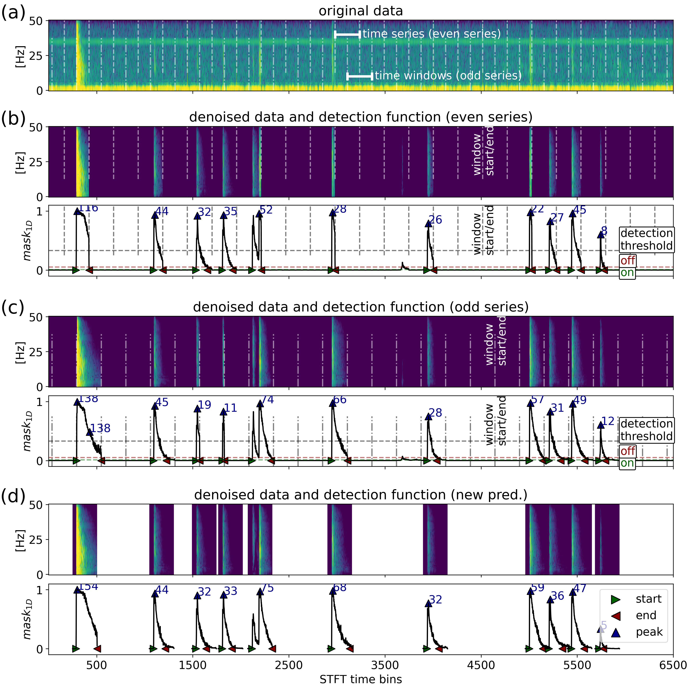
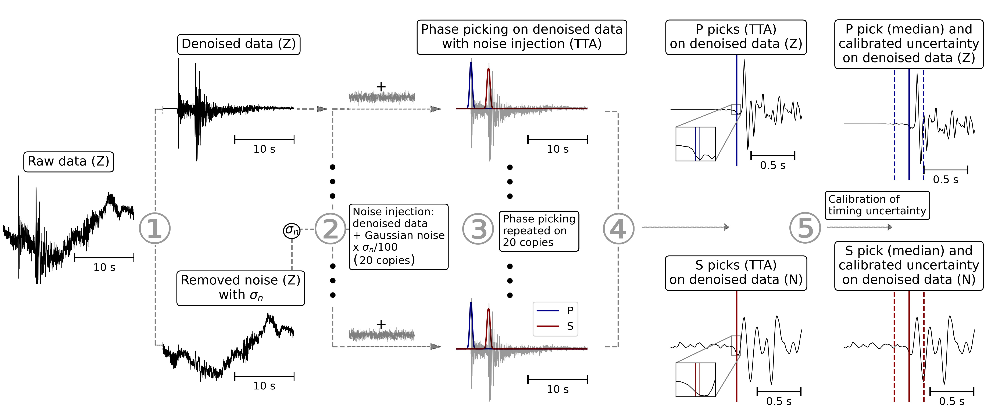

================================================================================


# Earthquake-Seismogram-Denoiser

================================================================================


Created by: Niko Dahmen
ETH Zurich
Contact: nikolaj.dahmen@eaps.ethz.ch

================================================================================


For details, see:

Dahmen, N., Clinton, J., Meier, M.-A., & Scarabello, L.. 
Towards Operational Earthquake Seismogram Denoising. 
Bulletin of the Seismological Society of America.


***EQS-Denoiser workflow.** Dahmen et al., BSSA*

### Environment Setup Instructions

Create and activate a virtual environment named `eqs` and install all dependencies listed in `requirements.txt`:

Linux: 
```bash
python3 -m venv eqs
source eqs/bin/activate
pip install --upgrade pip
pip install -r requirements.txt
```

Windows:
```bash
python -m venv eqs
eqs\Scripts\activate
python -m pip install --upgrade pip
pip install -r requirements.txt
```

================================================================================

Code examples:

Single time window denoising:
Notebook in [EQS-Denoiser_example.py](Code/EQS-Denoiser_example.py) 

================================================================================

### Denoising and signal detection on continuous data
Uses overlapping windows and detection scores to select the best waveform from parallel/overlapping denoised solutions (DenoiseData_terminal_public.py).


***Continuous Data Denoising.** Dahmen et al., BSSA*

Example: Data download from "ETH" Client, preprocessing, signal detection and denoising for 600s following 2025-02-07T17:00:00. both raw and denoised data are saved.
```
python ./DenoiseData_terminal_public.py CH MFERR ?? 2025-02-07T17:00:00 600 --saveraw True --model_name ../Models/model_1000k_onlyweights.keras --client_str ETH
```

```
------------------------------------------
Command-Line Arguments
------------------------------------------

Required arguments:
  network           (str)   Seismic network code (e.g., 'CH')
  station           (str)   Seismic station code (e.g., 'DIX')
  channel           (str)   Seismic channel code (e.g., 'HH')
  start_time        (str)   UTC start time to center time window around (e.g., '2025-02-07T17:00:00')
  duration          (float) Duration of data segment in seconds

Optional arguments:
  --threshold       (float) Detection score threshold to collect detections above this value (NOT RECOMMENDED TO CHANGE)
                           Default: 10.0

  --saveraw         (str)   Save preprocessed raw data if set to "True"
                           Default: "False"

  --model_name      (str)   Path to trained model file
                           Default: "model_paper"

  --verbose         (flag)  Enable verbose output (no value needed)

  --min_peak_height (float) Minimum threshold (0-1) for peak detection sensitivity (SET TO 0.33 IN STUDY)
                           Default: None

  --client_str      (str)   Client string, e.g., 'ETH', see https://docs.obspy.org/packages/obspy.clients.fdsn.html
                           Default: ETH

```
================================================================================


### Using phase picker on denoised data with Test Time Augmentation (Picking_public.py):


***Phase Picking with Test Time Augmentation.** Dahmen et al., BSSA*

